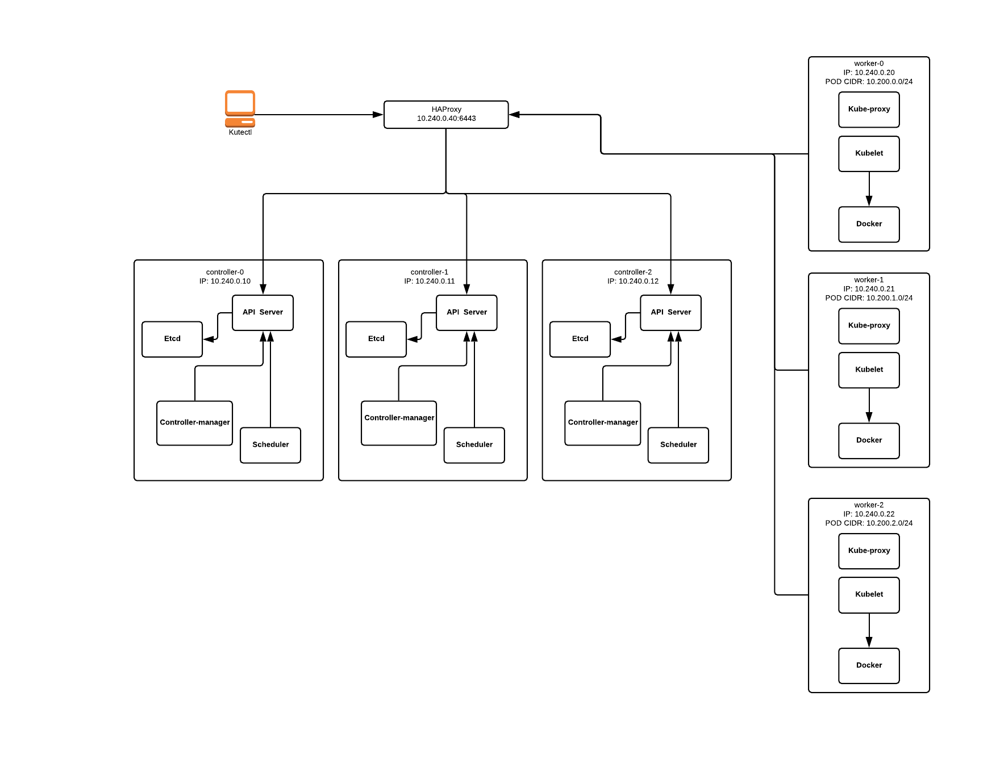

# Kubernetes The Hard Way (Vagrant/Ansible)

Vagrant  and Ansible configuration for a Kubernetes setup, the hard way.

The setup follows closely https://github.com/kelseyhightower/kubernetes-the-hard-way
with the following exceptions:

* `docker` is used as as default container runtime, `cri-containerd` is also supported.
* The `pod-cidr` is `10.200.${i}.0/24`.
* `10.240.0.40` is the IP of the loadbalancer (haproxy) for HA controllers



## Requirements Host

* Vagrant (with VirtualBox)
* Minimum of 7x 512MB of free RAM
* ansible 2.4+


## Setup

Download external ansible galaxy roles ( wtanaka.haproxy and reallyenglish.hosts )

```
ansible-galaxy install -r requirements.yml -p roles/

- downloading role 'haproxy', owned by wtanaka
- downloading role from https://github.com/wtanaka/ansible-role-haproxy/archive/master.tar.gz
- extracting wtanaka.haproxy to /home/mhersi/code/kubernetes-the-hard-way/roles/wtanaka.haproxy
- wtanaka.haproxy (master) was installed successfully
- downloading role 'hosts', owned by reallyenglish
- downloading role from https://github.com/reallyenglish/ansible-role-hosts/archive/1.2.0.tar.gz
- extracting reallyenglish.hosts to /home/mhersi/code/kubernetes-the-hard-way/roles/reallyenglish.hosts
- reallyenglish.hosts (1.2.0) was installed successfully

```

Start the virtual machines:

```
vagrant up
[...]
vagrant status

Current machine states:

lb-0                      running (virtualbox)
controller-0              running (virtualbox)
controller-1              running (virtualbox)
controller-2              running (virtualbox)
worker-0                  running (virtualbox)
worker-1                  running (virtualbox)
worker-2                  running (virtualbox)
```

Test ansible host connectivity:

```
ansible -i inventory -m ping all

controller-2 | SUCCESS => {
    "changed": false,
    "ping": "pong"
}
lb-0 | SUCCESS => {
    "changed": false,
    "ping": "pong"
}
controller-1 | SUCCESS => {
    "changed": false,
    "ping": "pong"
}
worker-0 | SUCCESS => {
    "changed": false,
    "ping": "pong"
}
controller-0 | SUCCESS => {
    "changed": false,
    "ping": "pong"
}
worker-1 | SUCCESS => {
    "changed": false,
    "ping": "pong"
}
worker-2 | SUCCESS => {
    "changed": false,
    "ping": "pong"
}
```

Bootstrap Kubernetes 1.9 Cluster:

```
ansible-playbook -i inventory k8s_cluster.yml
```

## Using the cluster

### Check Cluster status

Check the health of the remote Kubernetes cluster:

```
kubectl get componentstatuses
```

> output

```
NAME                 STATUS    MESSAGE              ERROR
scheduler            Healthy   ok                   
controller-manager   Healthy   ok                   
etcd-1               Healthy   {"health": "true"}   
etcd-2               Healthy   {"health": "true"}   
etcd-0               Healthy   {"health": "true"}
```

Check Kubernetes nodes status:

```
kubectl get nodes
```

> output

```
NAME       STATUS    ROLES     AGE       VERSION
worker-0   Ready     <none>    1h        v1.9.3
worker-1   Ready     <none>    1h        v1.9.3
worker-2   Ready     <none>    1h        v1.9.3
```
### Setup DNS add-on

Deploy the kube-dns cluster add-on:

```
kubectl create -f ./manifests/kube-dns/kube-dns.yaml
```

> output

```
serviceaccount "kube-dns" created
configmap "kube-dns" created
service "kube-dns" created
deployment "kube-dns" created
```

List the pods created by the `kube-dns` deployment:

```
kubectl get pods -l k8s-app=kube-dns -n kube-system
```

> output

```
NAME                        READY     STATUS    RESTARTS   AGE
kube-dns-6c857864fb-c9j46   3/3       Running   0          5m

```

Create a `busybox` deployment:

```
kubectl run busybox --image=busybox --command -- sleep 3600
```

List the pod created by the `busybox` deployment:

```
kubectl get pods -l run=busybox
```

> output

```
NAME                       READY     STATUS    RESTARTS   AGE
busybox-855686df5d-hnsdn   1/1       Running   0          1m
```

Retrieve the full name of the `busybox` pod:

```
POD_NAME=$(kubectl get pods -l run=busybox -o jsonpath="{.items[0].metadata.name}")
```

Execute a DNS lookup for the `kubernetes` service inside the `busybox` pod:

```
kubectl exec -ti $POD_NAME -- nslookup kubernetes
```

> output

```
Server:    10.32.0.10
Address 1: 10.32.0.10 kube-dns.kube-system.svc.cluster.local

Name:      kubernetes
Address 1: 10.32.0.1 kubernetes.default.svc.cluster.local
```
